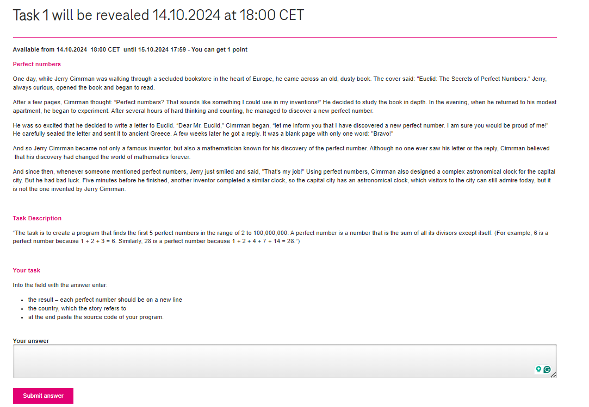

# Task 1 Description:

# My approach of how to Find a Perfect Number

First we have to understand how to find Perfect Numbers

## How to Find Perfect Numbers?

For example, let’s consider the number 6. Its divisors are 1, 2, and 3 (excluding 6). Adding these divisors gives 1 + 2 + 3 = 6. Therefore, by definition, 6 is a perfect number.

Another example is the number 496. Its divisors (factors) are 1, 2, 4, 8, 16, 31, 62, 124, and 248 (excluding 496). Adding these divisors results in 1 + 2 + 4 + 8 + 16 + 31 + 62 + 124 + 248 = 496, which, according to the definition, is a perfect number.

### Mersenne Prime Numbers

Before jumping to Euclid's perfect number theorem, we have to understand what Mersenne Prime number is.

In mathematics, a Mersenne prime is a prime number that is one less than a power of two.

It’s represented as **Mₙ = 2ⁿ − 1** for an integer n.

> For instance, 31 is a Mersenne prime because it’s 2⁵ − 1.

ok, now let's jump right to the point.

### Euclid’s Perfect Number Theorem

Euclid–Euler Theorem, also known as Euclid’s Perfect Number Theorem, connects Perfect Numbers to Mersenne Primes. It states that an even number is perfect if and only if it can be expressed in the form  where 2p-1 is a prime number.

Jacques Lefèvre, in 1496, suggested that the Euclid-Euler theorem encompasses all Perfect Numbers, implying the **non-existence of odd Perfect Numbers**.

According to **Euclid’s Perfect Number theorem:**

>  is an even perfect number where \(2^p - 1\) is a prime.

Similarly, we can generate the first four Perfect Number using the above formula (p is prime number):

Now let's code...