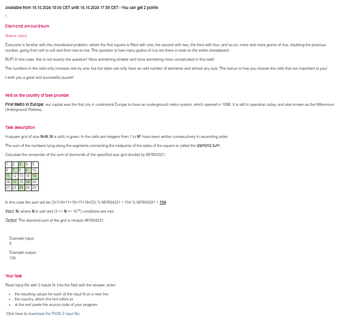

# Diamond Sum Puzzle

## Problem Overview

You are given a square grid of size `N x N`, where `N` is an odd number. The grid is filled with consecutive integers from `1` to `N^2` in ascending order. The goal is to compute the sum of the numbers located on the "diamond" shape formed by the midpoints of the sides of the square. After computing the sum, return the result modulo `987654321`.

## Problem Constraints

- `N` is odd
- `3 <= N <= 10^18`

## Example

For `N = 5`, the grid is as follows: 1 2 3 4 5 6 7 8 9 10 11 12 13 14 15 16 17 18 19 20 21 22 23 24 25

The sum of the numbers in the diamond pattern (3, 7, 9, 11, 15, 17, 19, 23) is: 3 + 7 + 9 + 11 + 15 + 17 + 19 + 23 = 104

The result is `104 % 987654321 = 104`.

## Explanation of the Inputs

We are provided with an input file that contains the following values: 1000 1000000 10000000000000

For each input `N`, we need to compute the sum of the diamond and return the result modulo `987654321`.

## Explanation of the Code

The problem asks us to compute the sum of values on the "diamond" pattern of the grid. However, given that `N` can be extremely large (up to 10^18), generating the entire grid is not feasible. Instead, we calculate the positions of the numbers on the diamond based on the structure of the grid.

### Approach

For any odd `N`, the diamond pattern includes the numbers at the midpoints of the sides of the grid. These positions can be computed directly without building the full grid.

For a given `N`:

1. Find the middle of each side.
2. Compute the sum of the values at those positions.
3. Return the result modulo `987654321`.

### Answers for the Task 2

The resulting values for each of the input N on a new line:

For N = 1000: 2001998

For N = 1000000: 1999973

For N = 10000000000000: 30998

The country, which the hint refers to:

The task provider refers to the first metro system in continental Europe, which is the Millennium Underground Railway in Budapest, Hungary, opened in 1896.
